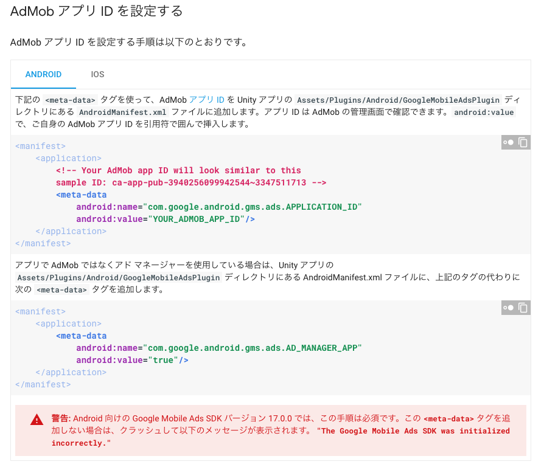
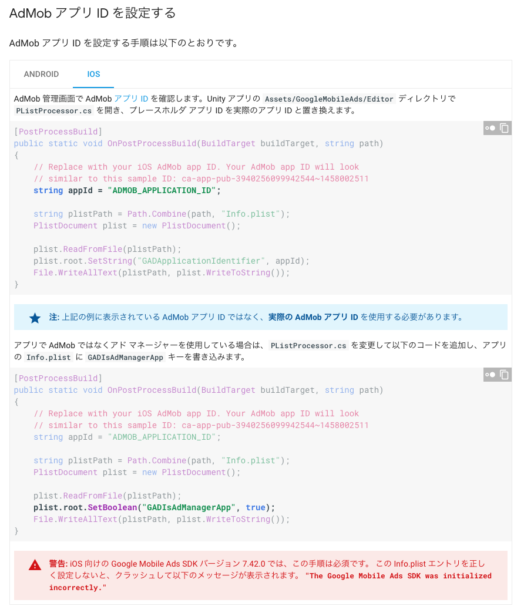

# GAMのUnityPluginを使った動画リワード配信の実装サンプル

## ドキュメント

[スタートガイド | Unity | Google Developers](https://developers.google.com/admob/unity/start)

簡単に実装したスクリプトは[Assets/Scripts/GAMReward.cs](Assets/Scripts/GAMReward.cs)に置いてあるので参考にしてください。

## もらったIDでテストしたい場合

以下の処理の`adUnitID`の値をOSに合わせて改変してください。

```c#
    #region RewardBasedVideoAd request

    private void requestRewardBasedVideoAd()
    {
        var adUnitID = String.Empty;
#if UNITY_EDITOR
        adUnitID = "unused";
#elif UNITY_ANDROID
        // ここにAndroid用に発行してもらったadUnitIDを入れる
        adUnitID = "/6499/example/rewarded-video";
#elif UNITY_IPHONE
        // ここにiOS用に発行してもらったadUnitIDを入れる
        adUnitID = "/6499/example/rewarded-video";
#else
        adUnitID = "unexpected_platform";
#endif
        var request = new AdRequest.Builder().Build();
        this.rewardBasedVideoAd.LoadAd(request, adUnitID);
    }

    #endregion
```

## 注意点

GAMで発行された場合、AdUnitIDのみ渡されます。
しかし、上記のドキュメントに以下の記載があってどうすればいいか混乱するかと思われます。

```c#
...
using GoogleMobileAds.Api;
...
public class GoogleMobileAdsDemoScript : MonoBehaviour
{
    public void Start()
    {
        #if UNITY_ANDROID
            string appId = "ca-app-pub-3940256099942544~3347511713";
        #elif UNITY_IPHONE
            string appId = "ca-app-pub-3940256099942544~1458002511";
        #else
            string appId = "unexpected_platform";
        #endif

        // Initialize the Google Mobile Ads SDK.
        MobileAds.Initialize(appId);
    }
}
```

しかし、GAM経由で発行したAdUnitIDを使用してGoogle Mobile Ads SDKを使用する場合、上記の処理は必要ありません。

### Androidの設定の注意点

以下の設定を必ずするようにしてください。

> アプリで AdMob ではなくアド マネージャーを使用している場合は、Unity アプリの Assets/Plugins/Android/GoogleMobileAdsPlugin ディレクトリにある AndroidManifest.xml ファイルに、上記のタグの代わりに次の <meta-data> タグを追加します。

```xml
<manifest>
    <application>
        <meta-data
            android:name="com.google.android.gms.ads.AD_MANAGER_APP"
            android:value="true"/>
    </application>
</manifest>
```



### iOSの設定の注意点

AdMobのSDKの7.42.0からnfo.plistに必要な値（AppID or AdManagerを使用するフラグ）がないと起動時にクラッシュするようになりました。

`Assets/GoogleMobileAds/Editor`ディレクトリにある`PListProcessor.cs`を開いて以下のように記述を追加します。

```cs

public static class PListProcessor
{
    [PostProcessBuild]
    public static void OnPostProcessBuild(BuildTarget buildTarget, string path)
    {
        // Replace with your iOS AdMob app ID. Your AdMob App ID will look
        // similar to this sample ID: ca-app-pub-3940256099942544~1458002511

				// appIdは使用しないのでコメントアウト
        // string appId = "ADMOB_APPLICATION_ID";

        string plistPath = Path.Combine(path, "Info.plist");
        PlistDocument plist = new PlistDocument();

        plist.ReadFromFile(plistPath);
				// ここも使用しないのでコメントアウト
        // plist.root.SetString("GADApplicationIdentifier", appId);
				// これを追加する
        plist.root.SetBoolean("GADIsAdManagerApp", true);

        File.WriteAllText(plistPath, plist.WriteToString());
    }
}
```


